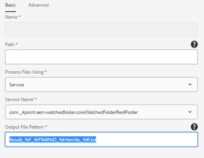
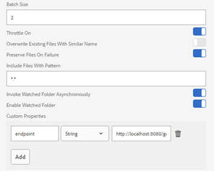

# WatchedFolderUtils

AEM Watched Folder Utilities

## AEM Watched Folder Poster

This is an AEM Watched Folder Processor (OSGi bundle) that will take files dropped into the watched folder and POST them
to a REST service. This project also contains a mock Spring Boot client that demonstrates how the receiving 
end of this connection can be implemented.

### Installing the bundle

To install the Watched Folder Poster, download the latest `watched-folder-poster-0.0.1-SNAPSHOT.jar` from the 
this project's GitHub Package repository and then copy it into the install directory of the AEM instance. 
This should cause AEM to install the bundle.  It should be present and `active` in the AEM Bundles console.

After the bundle is installed successfully, it should be available for use when configuring a watched folder.

### Configuring the watched folder

1) Follow instructions found in [Adobe “Create or Configure a watched folder” documentation](https://experienceleague.adobe.com/docs/experience-manager-65/forms/publish-process-aem-forms/creating-configure-watched-folder.html).  
2) Configure the Watched Folder with the following things:
	1) `Path` set to the location where the watched folder resides (e.g. `C:\WatchedFolder`)
	1) `Process Files Using` should be set to `Service`.
	1) `Service Name` should have the `com._4point.aem.watchedfolder.core.WatchedFolderRestPoster` entry selected.
	1) `Output File Pattern` can be set to whatever you want the output filenames to be (e.g `Result_%F_%Y%M%D_%h%m%s_%R.txt`).

		

3) 	Configure endpoint to point to a REST Service
	1) In Advance tab
	2) Scroll to bottom and click Add button under Custom Properties
	3) Enter endpoint in first field and select string for type and enter URL (e.g. http://_machine:port_/getDocument) to the REST service.  For example, this might be `http://localhost:8090/getDocument` if the REST server is running locally on port 8090 . See below for reference:

		
	
  

